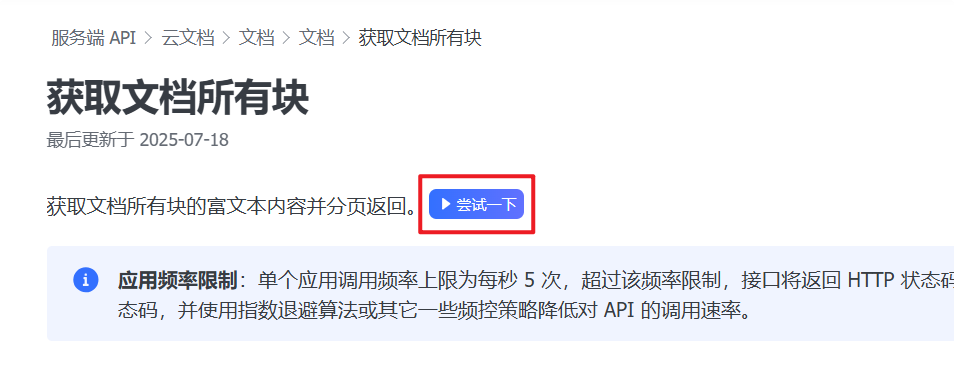
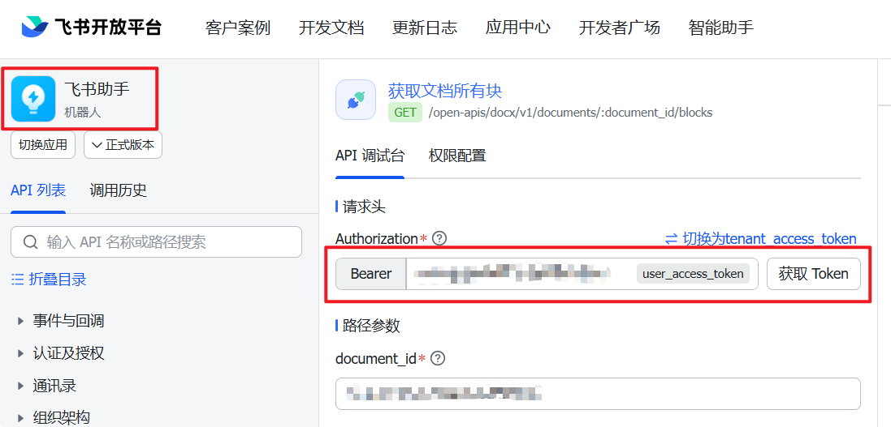
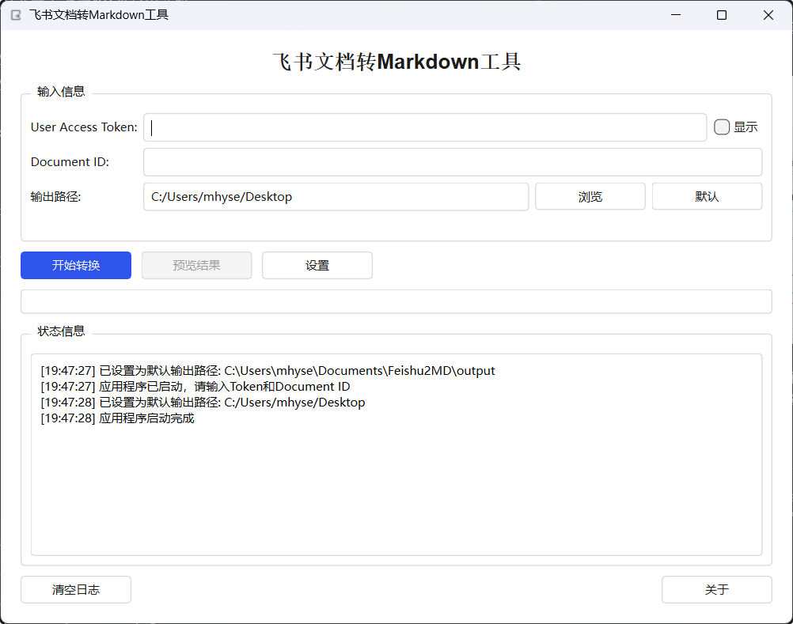

# 准备工作
## 创建飞书应用
1. 登录 [飞书开放者后台](https://open.feishu.cn/app)。
2. 在 **企业自建应用** 页签内，点击 **创建企业自建应用**。
3. 设置应用名称、描述、图标并点击 创建。
企业自建应用详细配置说明参见 [创建企业自建应用](https://open.larkoffice.com/document/develop-process/self-built-application-development-process#a0a7f6b0)。
4. 为应用添加相应权限，至少需要具备云文档的阅读、编辑等文档权限 ( 如果不确定开通哪个权限，可以把云文档权限全部打开 )。
   参考权限开通位置：
   
   具体权限需要可参考这个文档：[获取文档所有块](https://open.feishu.cn/document/server-docs/docs/docs/docx-v1/document/list)

   注意，当前程序使用user_access_token，不是tenant_access_token！
5. 完成各项配置后，发布应用，使配置生效。
    a. 在应用的 版本管理与发布 页面，点击 创建版本。
    b. 完成应用版本号、移动端/桌面端的默认能力、更新说明等配置项后，点击页面底部 保存。
    c. 在弹出的对话框内点击确认发布。
    d. 需等待企业管理员审核应用，审核通过后应用才会发布成功。

**具备个人知识库访问权限的应用才能成功完成文档转换。**
## 文档document_id获取
直接复制知识库原文档链接，例如：
```
https://tsaae9fgrn.feishu.cn/wiki/KT5Xws**************dcRr1Fnfb?fromScene=spaceOverview
```

上述链接中，wiki/后面，?之前的部分，KT5Xws**************dcRr1Fnfb 就是 **知识库文档的 document_id**。

当前版本程序只对知识库文档进行了转换测试，也就是具有**wiki**标签的链接，云文档链接暂未测试。
## user_access_token获取
最简单的获取方式就是在官方调试API平台中获取，例如[获取文档所有块](https://open.feishu.cn/document/server-docs/docs/docs/docx-v1/document/list)。使用刚才创建的应用




注意，**user_access_token具有时效性，每次使用本软件之前最好都重新获取一次**。

# 软件使用
本软件已完成打包，直接下载exe程序即可使用。

启动软件，将上述获取到的user_access_token和document_id输入到软件中，点击转换即可。



转换完成后，会在软件所在目录生成一个md文件，文件名就是知识库文档的标题。

